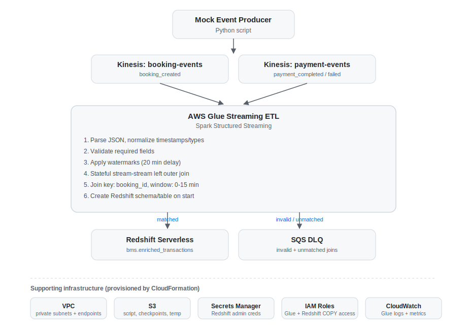
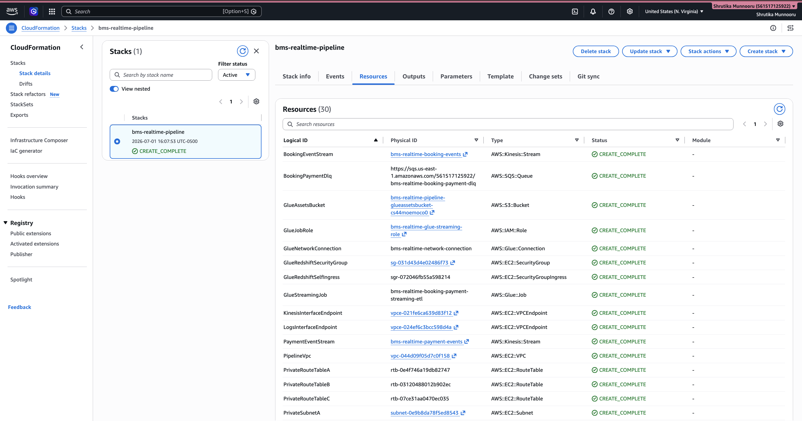
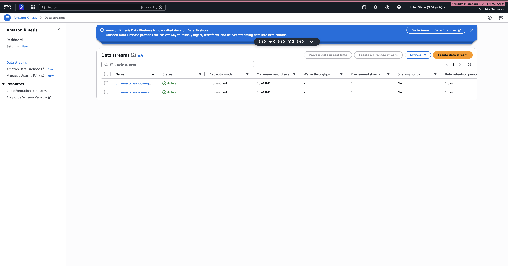
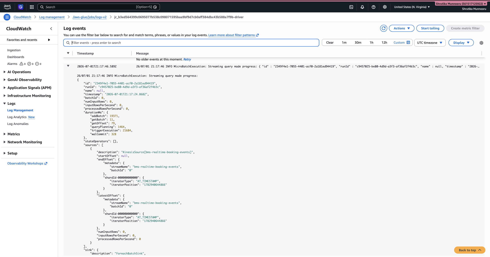
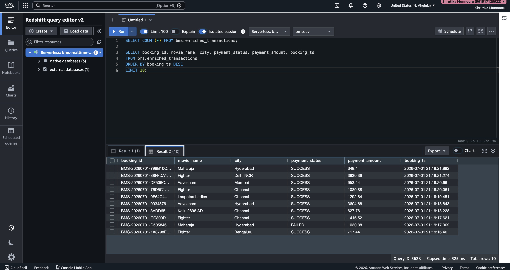

# BookMyShow Real-Time Data Processing Pipeline on AWS

## Problem Statement

Large ticketing platforms generate booking events and payment events from different transactional systems. Those events often arrive at different times, and some bookings never receive a valid payment.

The goal is to process both streams in near real time and produce an enriched analytics table that business teams can query for:

- revenue
- payment success rate
- city-level performance
- movie-level performance
- failed payment patterns
- unmatched booking-payment cases

The project handles these scenarios:

- a booking receives a successful payment within the join window
- a booking receives a failed payment within the join window
- a booking never receives a payment event
- a payment arrives outside the accepted event-time window
- a booking or payment event is malformed

## Tech Stack

- **Python**: realistic mock data generator
- **Amazon Kinesis Data Streams**: booking and payment event ingestion
- **AWS Glue Streaming ETL**: Spark Structured Streaming job
- **Spark Structured Streaming**: stateful stream-stream joins with watermarks
- **Amazon SQS**: DLQ for invalid events and unmatched joins
- **Amazon Redshift Serverless**: analytics warehouse
- **Amazon S3**: Glue script, checkpoints, Glue temp files, and Redshift temp files
- **AWS CloudFormation**: full AWS resource provisioning
- **AWS IAM**: Glue and Redshift service roles
- **Amazon VPC**: private networking for Glue and Redshift connectivity
- **AWS Secrets Manager**: generated Redshift admin credentials
- **Amazon CloudWatch**: Glue logs and job metrics

## Architecture

```text
Python Mock Producer
   |
   | booking_created events
   v
Kinesis Data Stream: <project>-booking-events

Python Mock Producer
   |
   | payment_completed / payment_failed events
   v
Kinesis Data Stream: <project>-payment-events

                  +-------------------------------------------+
                  | AWS Glue Streaming ETL                    |
                  | Spark Structured Streaming                |
                  |                                           |
                  | 1. Read both Kinesis streams              |
                  | 2. Parse JSON using explicit schemas      |
                  | 3. Normalize timestamps and numeric types |
                  | 4. Validate required fields               |
                  | 5. Send invalid records to SQS            |
                  | 6. Watermark booking and payment streams  |
                  | 7. Stateful left outer stream join        |
                  | 8. Create Redshift schema/table           |
                  | 9. Write matched rows to Redshift         |
                  | 10. Send unmatched rows to SQS            |
                  +-------------------+-----------------------+
                                      |
                matched records       |       invalid / unmatched records
                    v                 |                v
        Redshift Serverless           |          SQS DLQ
        bms.enriched_transactions     |
```



## What CloudFormation Creates

The template is here:

[cloudformation/bookmyshow_realtime_pipeline.yaml](cloudformation/bookmyshow_realtime_pipeline.yaml)

It creates:

- VPC with three private subnets
- security group for Glue and Redshift
- VPC endpoints for S3, Kinesis, SQS, Secrets Manager, Redshift Data API, and CloudWatch Logs
- Kinesis stream for booking events
- Kinesis stream for payment events
- SQS queue for invalid events and unmatched joins
- S3 bucket for Glue assets, checkpoints, and Redshift temp files
- Redshift Serverless namespace and workgroup
- generated Redshift admin secret in Secrets Manager
- IAM role for Redshift COPY/UNLOAD access to the S3 temp path
- IAM role for Glue access to Kinesis, SQS, S3, Redshift Data API, Secrets Manager, and Redshift COPY role passing
- Glue network connection
- Glue streaming job

You do not manually create Kinesis, SQS, S3, IAM, Redshift Serverless, VPC, security groups, or the Glue job.

## Failed Join Behavior

A failed join means a booking did not receive a matching payment within the accepted event-time window.

Default settings:

- join key: `booking_id`
- join condition: `payment_ts >= booking_ts`
- join condition: `payment_ts <= booking_ts + 15 minutes`
- watermark delay: `20 minutes`
- failed join output: SQS message with `dlq_source = unmatched_booking_payment_join`

Important distinction:

- `payment_status = FAILED` is still a valid joined business event if the failed payment arrived within the join window.
- `unmatched_booking_payment_join` means no matching payment event arrived in the valid time window.

Spark emits unmatched rows only after the watermark proves that the join window has closed, so DLQ messages for unmatched records appear with a delay.

## Repository Structure

```text
bookmyshow-aws-realtime-pipeline/
├── cloudformation/
│   └── bookmyshow_realtime_pipeline.yaml
├── config/
│   └── example.env
├── glue_jobs/
│   └── bookmyshow_streaming_etl.py
├── producers/
│   └── mock_bms_event_producer.py
├── scripts/
│   ├── delete_stack.sh
│   ├── deploy_stack.sh
│   ├── start_glue_job.sh
│   └── upload_glue_job.sh
├── sql/
│   ├── analytics_queries.sql
│   └── redshift_schema.sql
├── requirements-producer.txt
└── README.md
```

## Glue Streaming Job

Main file:

[glue_jobs/bookmyshow_streaming_etl.py](glue_jobs/bookmyshow_streaming_etl.py)

The job is intentionally written in a sequential, readable style:

1. Load runtime arguments from the CloudFormation-created Glue job.
2. Read Redshift credentials from Secrets Manager.
3. Create the Redshift schema and table through the Redshift Data API.
4. Read booking events from Kinesis.
5. Read payment events from Kinesis.
6. Parse JSON using explicit schemas.
7. Normalize timestamps.
8. Validate booking and payment records.
9. Write invalid records to SQS.
10. Apply watermarks.
11. Perform a stateful stream-stream left outer join.
12. Write matched records to Redshift.
13. Write unmatched records to SQS after the watermark closes the window.

The Redshift write uses Glue's Redshift connector with:

- JDBC URL generated by CloudFormation from the Redshift Serverless endpoint
- username/password from Secrets Manager
- `redshiftTmpDir` in the stack-created S3 bucket
- `aws_iam_role` using the stack-created Redshift COPY role

## Mock Data Generator

Main file:

[producers/mock_bms_event_producer.py](producers/mock_bms_event_producer.py)

It creates realistic BookMyShow-style data:

- Indian cities and multiplex venues
- real-looking movie names, languages, genres, and certificates
- seat numbers, ticket categories, fees, taxes, discounts, and final amount
- app/web channels and device types
- payment methods such as UPI, card, wallet, and net banking
- gateway providers and failure reasons

It intentionally produces:

- successful payments
- failed payments
- missing payment events
- out-of-window payment events

## Deployment

### 1. Configure AWS CLI

```bash
aws configure
aws sts get-caller-identity
```

### 2. Move Into the Project Folder

```bash
cd bookmyshow-aws-realtime-pipeline
```

### 3. Deploy the CloudFormation Stack

Recommended one-command deployment:

```bash
aws cloudformation deploy \
  --region us-east-1 \
  --stack-name bms-realtime-pipeline \
  --template-file cloudformation/bookmyshow_realtime_pipeline.yaml \
  --capabilities CAPABILITY_NAMED_IAM \
  --parameter-overrides ProjectName=bms-realtime
```

For local development tools or BI clients that need to connect to Redshift directly, the helper script opens Redshift publicly on port `5439`:

```bash
./scripts/deploy_stack.sh
```

By default, this allows `0.0.0.0/0` for demo convenience. Use this only for demos. For production, keep Redshift private and restrict `ALLOWED_CLIENT_IP_CIDR` to known static IPs.

Or use the helper script:

```bash
export AWS_REGION=us-east-1
export STACK_NAME=bms-realtime-pipeline
export PROJECT_NAME=bms-realtime

bash scripts/deploy_stack.sh
```

By default, `scripts/deploy_stack.sh` enables demo-friendly public Redshift access, allows `0.0.0.0/0` on port `5439`, and force-updates the Redshift Serverless workgroup public flag after CloudFormation. Override `ENABLE_PUBLIC_REDSHIFT_ACCESS` or `ALLOWED_CLIENT_IP_CIDR` only if you need a different setting.

The deployment creates all AWS resources. It may take several minutes because Redshift Serverless and VPC endpoints are provisioned.

If an earlier deployment failed while creating `RedshiftNamespace`, delete the failed stack first and redeploy. CloudFormation will generate a new Redshift password using the corrected character rules.

If an earlier deployment failed while creating `GlueStreamingJob`, delete the failed stack and redeploy with the latest template. The Glue JDBC URL now uses Redshift Serverless port `5439` as a string so CloudFormation can create the job arguments correctly.

If the Glue job fails with `Column 'event_type' does not exist` or `Column 'data' does not exist`, upload the latest Glue script again. The job uses Spark's native Kinesis streaming reader so the script receives the raw Kinesis payload and parses the JSON itself.

The Redshift table is created by the Glue job if it does not already exist. Money fields use `DOUBLE PRECISION` so the table schema matches the Spark `double` output from the streaming job.

If a Redshift connectivity test resolves the endpoint to `10.70.x.x` and then times out, Redshift is private. Run `./scripts/deploy_stack.sh` again; the helper script sets `EnablePublicRedshiftAccess=true`, `AllowedClientIpCidr=0.0.0.0/0`, and directly force-updates the Redshift workgroup public flag.

### 4. Review Stack Outputs

```bash
aws cloudformation describe-stacks \
  --region us-east-1 \
  --stack-name bms-realtime-pipeline \
  --query "Stacks[0].Outputs" \
  --output table
```

Important outputs:

- `BookingStreamName`
- `PaymentStreamName`
- `DlqQueueUrl`
- `GlueAssetsBucketName`
- `GlueJobName`
- `RedshiftWorkgroupName`
- `RedshiftDatabaseName`
- `RedshiftAdminSecretArn`

### 4a. Fetch Redshift Username and Password

CloudFormation stores the generated Redshift admin credentials in AWS Secrets Manager. Use the stack output `RedshiftAdminSecretArn` to fetch them.

```bash
export AWS_REGION=us-east-1
export STACK_NAME=bms-realtime-pipeline

export REDSHIFT_SECRET_ARN=$(aws cloudformation describe-stacks \
  --region "$AWS_REGION" \
  --stack-name "$STACK_NAME" \
  --query "Stacks[0].Outputs[?OutputKey=='RedshiftAdminSecretArn'].OutputValue | [0]" \
  --output text)
```

Print the complete secret JSON:

```bash
aws secretsmanager get-secret-value \
  --region "$AWS_REGION" \
  --secret-id "$REDSHIFT_SECRET_ARN" \
  --query SecretString \
  --output text
```

Export the username and password for local tools or Python tests:

```bash
export REDSHIFT_USER=$(aws secretsmanager get-secret-value \
  --region "$AWS_REGION" \
  --secret-id "$REDSHIFT_SECRET_ARN" \
  --query SecretString \
  --output text | python3 -c 'import json,sys; print(json.load(sys.stdin)["username"])')

export REDSHIFT_PASSWORD=$(aws secretsmanager get-secret-value \
  --region "$AWS_REGION" \
  --secret-id "$REDSHIFT_SECRET_ARN" \
  --query SecretString \
  --output text | python3 -c 'import json,sys; print(json.load(sys.stdin)["password"])')

echo "Redshift user: $REDSHIFT_USER"
```

For Query Editor v2 or a local Redshift client, use:

```text
Host: bms-realtime-wg.<your-account-id>.us-east-1.redshift-serverless.amazonaws.com
Port: 5439
Database: bmsdev
Username: value of REDSHIFT_USER
Password: value of REDSHIFT_PASSWORD
SSL: require / enable
```

### 5. Upload the Glue Script

CloudFormation creates the Glue job and S3 bucket, but the local Glue script still needs to be uploaded to that bucket.

```bash
bash scripts/upload_glue_job.sh
```

Equivalent manual command:

```bash
GLUE_ASSETS_BUCKET=$(aws cloudformation describe-stacks \
  --region us-east-1 \
  --stack-name bms-realtime-pipeline \
  --query "Stacks[0].Outputs[?OutputKey=='GlueAssetsBucketName'].OutputValue | [0]" \
  --output text)

aws s3 cp \
  glue_jobs/bookmyshow_streaming_etl.py \
  "s3://${GLUE_ASSETS_BUCKET}/scripts/bookmyshow_streaming_etl.py" \
  --region us-east-1
```

### 6. Start the Glue Streaming Job

```bash
bash scripts/start_glue_job.sh
```

Equivalent manual command:

```bash
GLUE_JOB_NAME=$(aws cloudformation describe-stacks \
  --region us-east-1 \
  --stack-name bms-realtime-pipeline \
  --query "Stacks[0].Outputs[?OutputKey=='GlueJobName'].OutputValue | [0]" \
  --output text)

aws glue start-job-run \
  --region us-east-1 \
  --job-name "$GLUE_JOB_NAME"
```

The Glue job creates the Redshift schema/table automatically when it starts.

### 7. Run the Mock Producer

Create and activate a local virtual environment:

```bash
python3 -m venv .venv
source .venv/bin/activate
pip install -r requirements-producer.txt
```

Export stream names from CloudFormation outputs:

```bash
export AWS_REGION=us-east-1
export BOOKING_STREAM_NAME=$(aws cloudformation describe-stacks \
  --region "$AWS_REGION" \
  --stack-name bms-realtime-pipeline \
  --query "Stacks[0].Outputs[?OutputKey=='BookingStreamName'].OutputValue | [0]" \
  --output text)

export PAYMENT_STREAM_NAME=$(aws cloudformation describe-stacks \
  --region "$AWS_REGION" \
  --stack-name bms-realtime-pipeline \
  --query "Stacks[0].Outputs[?OutputKey=='PaymentStreamName'].OutputValue | [0]" \
  --output text)
```

Run a limited test:

```bash
python producers/mock_bms_event_producer.py \
  --event-count 100 \
  --interval-seconds 0.5
```

Run continuously:

```bash
python producers/mock_bms_event_producer.py
```

Generate more unmatched and failed-payment test cases:

```bash
python producers/mock_bms_event_producer.py \
  --event-count 500 \
  --interval-seconds 0.25 \
  --unmatched-payment-rate 0.10 \
  --out-of-window-payment-rate 0.05 \
  --failed-payment-rate 0.08
```

## Validation

### 1. Check Glue Logs

Open CloudWatch Logs for the Glue job and confirm:

- the job starts successfully
- Redshift schema/table initialization finishes
- Kinesis micro-batches are running
- Redshift writes are happening
- SQS DLQ writes are happening for invalid or unmatched records

### 2. Query Redshift

You can query Redshift Serverless through Query Editor v2.

The table is:

```text
bms.enriched_transactions
```

Basic checks:

```sql
SELECT COUNT(*) FROM bms.enriched_transactions;

SELECT *
FROM bms.enriched_transactions
ORDER BY booking_ts DESC
LIMIT 20;
```

Business queries are available here:

[sql/analytics_queries.sql](sql/analytics_queries.sql)

They include:

- successful revenue for the last 7 days
- successful payment rate
- top cities
- top movies
- payment failure reasons

You can also connect from a local Redshift client (e.g. `psql`) using the values from the stack outputs and the Secrets Manager credentials pulled earlier:

```bash
psql "host=<RedshiftWorkgroupEndpoint> port=5439 dbname=bmsdev user=awsuser sslmode=require"
```

The workgroup endpoint isn't a CloudFormation output directly — get it from the Redshift Serverless console (Workgroup configuration) or via `aws redshift-serverless get-workgroup`. Note this only works if `EnablePublicRedshiftAccess` was set to `true` at deploy time; by default Redshift is private and only reachable from inside the VPC (e.g. through the Glue job itself, or Query Editor v2 in the console).

### 3. Check SQS DLQ

Get the queue URL:

```bash
DLQ_QUEUE_URL=$(aws cloudformation describe-stacks \
  --region us-east-1 \
  --stack-name bms-realtime-pipeline \
  --query "Stacks[0].Outputs[?OutputKey=='DlqQueueUrl'].OutputValue | [0]" \
  --output text)
```

Receive messages:

```bash
aws sqs receive-message \
  --region us-east-1 \
  --queue-url "$DLQ_QUEUE_URL" \
  --max-number-of-messages 10 \
  --wait-time-seconds 5
```

Expected `dlq_source` values:

```text
invalid_booking_event
invalid_payment_event
unmatched_booking_payment_join
```

## Deployment Evidence

This pipeline was deployed end to end on a live AWS account, run against real traffic from the mock producer, validated, then torn down. Screenshots below are from that run.

**Infrastructure provisioned by CloudFormation** — all ~30 resources (VPC, subnets, Kinesis streams, SQS DLQ, S3 bucket, Redshift Serverless namespace/workgroup, IAM roles, Glue connection and job) reached `CREATE_COMPLETE`:



**Kinesis streams active and receiving events** from the mock producer:



The Glue Streaming ETL job ran continuously for 15m13s on 2 DPUs (G.1X), totaling 0.5075 DPU-hours, and was stopped manually once validation was complete.

**Spark Structured Streaming internals**, pulled from CloudWatch Logs (`/aws-glue/jobs/logs-v2`), confirming the job is actually running a stateful streaming query against the Kinesis source and writing through the `ForeachBatchSink` (the `process_joined_batch` function that splits matched rows to Redshift and unmatched rows to SQS):



**Enriched transactions landing in Redshift Serverless** — row count from the live run, followed by a sample of matched booking-payment pairs including both `SUCCESS` and `FAILED` payment statuses (a failed payment that arrives within the join window is still a valid matched transaction, not a DLQ case):




The mock producer was also run with elevated edge-case rates (`--unmatched-payment-rate`, `--out-of-window-payment-rate`) to generate bookings with no payment event at all, exercising the unmatched-join path described above rather than only the happy path.

> Screenshots live in `screenshots/`. AWS account IDs are cropped from all images before publishing.

## Cleanup

Use the helper script:

```bash
bash scripts/delete_stack.sh
```

Or delete manually:

```bash
aws cloudformation delete-stack \
  --region us-east-1 \
  --stack-name bms-realtime-pipeline
```

If the Glue streaming job is running, stop it before deleting the stack.

## Implementation Notes

- No AWS Lambda is used for streaming processing.
- No DynamoDB is used for join state.
- Spark manages state internally through Structured Streaming.
- Glue checkpoints are stored in S3.
- Failed joins and invalid records are sent to SQS, not S3.
- S3 is used for Glue scripts, checkpoints, and Redshift temporary files.
- Redshift tables are created automatically by the Glue job.
- Glue writes to Redshift using the stack-created JDBC URL, generated secret, S3 temp directory, and Redshift COPY IAM role.
